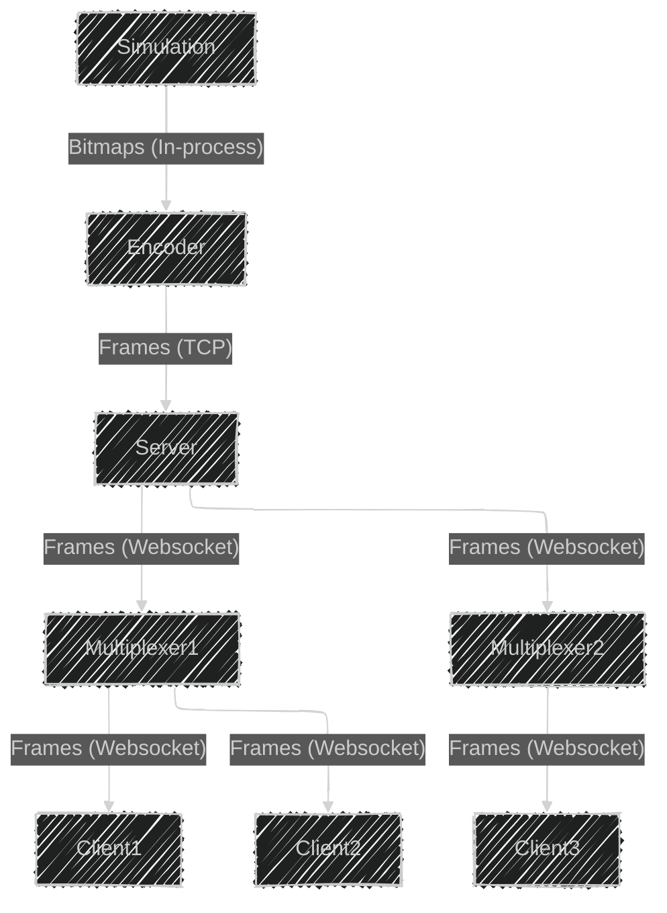

# Architecture

## Diagrams

### Simple


### With multiplexer scaling



### Client-server interaction


## Protocol

Frame format:
```
----------------------------------
| version | type | length | data |
----------------------------------
```