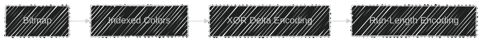

# Architecture

## Diagrams

### Simple


### With multiplexer scaling


### Client-server interaction


## Protocol

### Frame format

```
----------------------------------
| version | type | length | data |
----------------------------------
```

### Encoding scheme



### Late joiners

Every nth frame is an I-Frame and the rest are P-Frames. On a new client connection, the server will wait for the next I-Frame before it starts forwarding frames to the client. This allows clients to connect at any point during the simulation.